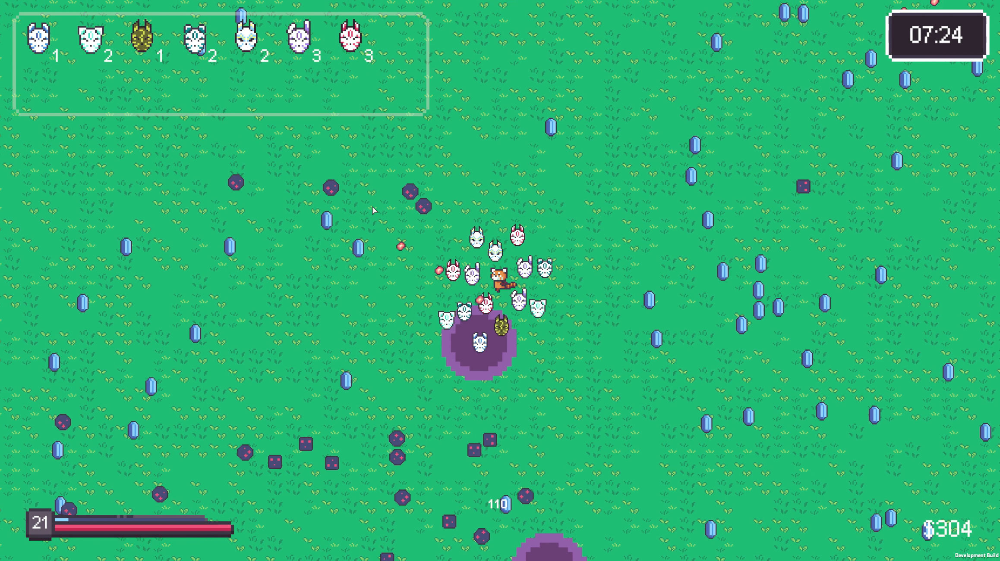
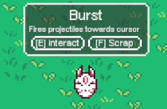
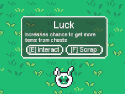
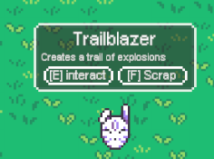

# Masked survivors

This is the repository for **Masked Survivors**, which is a game developed during the global gamejam 2026 featuring the theme "Mask".
This game was developed in Unity 6 as solo developer, and has continued development since the game jam to turn it into a fleshed out game.

## The Game

In this Vampire Survivors-like game you collect masks that orbit the player and hurl attacks at the endless horde of incoming enemies.

  

By eliminating enemies the player collects coins, which can be used to open chests scattered around the environment.
Opening one of these chests will reward the player with a random mask that will start orbiting the player on pickup and provide passive buffs or hurl attacks at nearby enemies.
Here are some of the masks that can be found in the game:

         

The game is currently still in development, future updates will include:
- More items
- More enemy variety
- Shops
